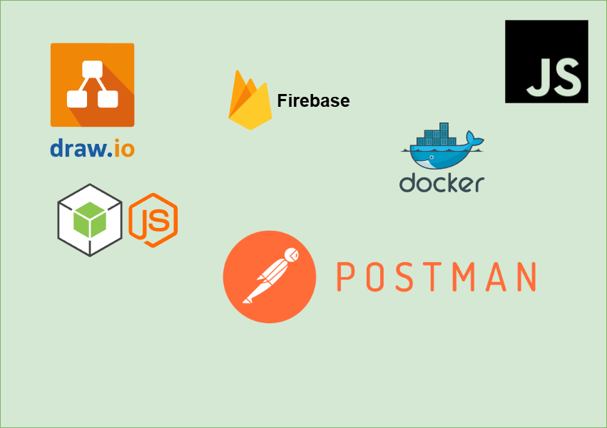
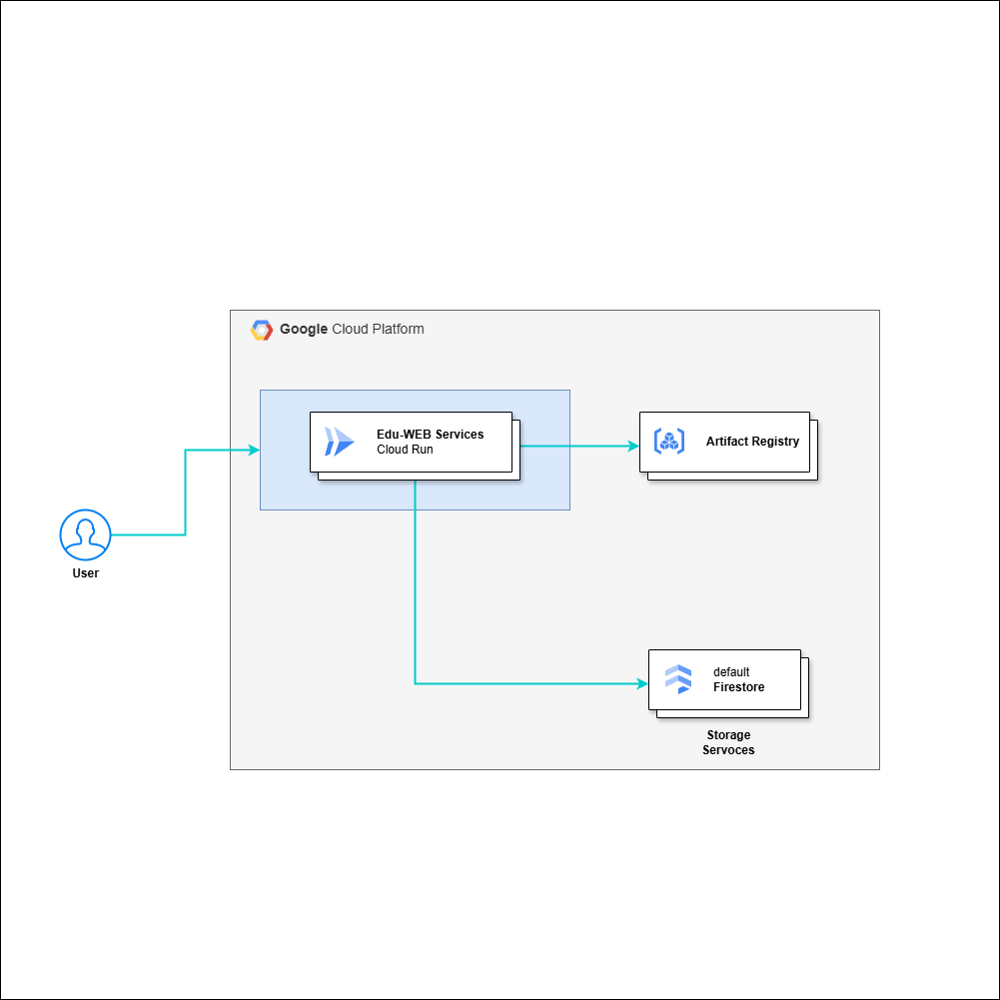
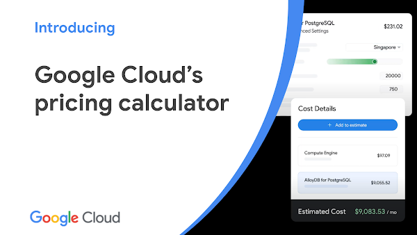

# Edu-WEB Traditional Toy Scanner

Bangkit Capstone Team ID : C242-PR639	  
Here is our repository for the Bangkit 2024 Capstone project - Cloud Computing.

## DESCRIPTION
Cloud Computing is responsible for creating and managing APIs, databases, and servers, so that the features I have designed in this website, the data and information entered by users and technicians can be used, stored, and maintained properly.

## TOOLS

- JavaScript
- Node js
- Framework : Hapi js
- Google Cloud Platform
- Firebase
- Postman
- Draw.io
- Google Cloud Pricing Calculator

## CLOUD ARCHITECTURE

## Google Cloud Pricing Calculator

The Google Cloud Pricing Calculator is used in our project to estimate and plan cloud costs effectively. It provides detailed cost projections based on selected services, usage scenarios, and configurations. This tool helps ensure that we stay within budget, optimize resource allocation, and make informed decisions by comparing different setups and pricing options before implementation.

[EstimatedCostperMonth](Architecture/cost.jpeg)

## TravelIn DOCUMENTATION API

We use Postman as a documentation of our API is because of its intuitive and structured platform for describing endpoints, parameters, headers, and API responses. Features like Collections, Environment Variables, and API Documentation make it easier to manage interactive and developer-friendly documentation. Additionally, its direct integration with API testing ensures that the documentation remains accurate and up-to-date with the latest functionality.

[Edu-WEB API Documentation on Postman](https://documenter.getpostman.com/view/39629717/2sAYHxmiNT)

