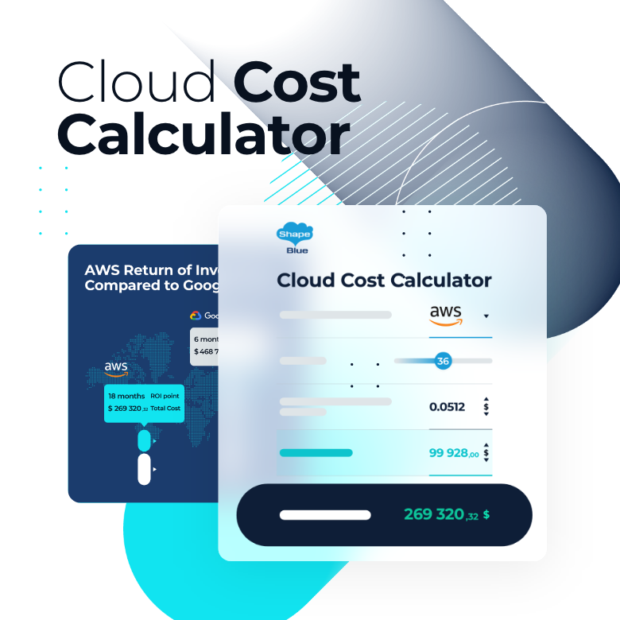

# Edu-WEB Traditional Toy Scanner

Bangkit Capstone Team ID : C242-PR639	  
Here is our repository for the Bangkit 2024 Capstone project - Cloud Computing.

## DESCRIPTION
Cloud computing plays a vital role in the development, deployment, and management of APIs, databases, and servers. It ensures that all the features designed for this website, as well as the data entered by users and technicians, are processed efficiently, stored securely, and maintained consistently. With cloud technology, we can scale our solution, optimize resources, and ensure smooth performance as we deliver the Edu-WEB Traditional Toy Scanner.

## TOOLS

- JavaScript
- Node js
- Framework : Hapi js
- Google Cloud Platform
- Firebase
- Postman
- Draw.io
- Google Cloud Pricing Calculator

## CLOUD ARCHITECTURE

## Google Cloud Pricing Calculator

The Google Cloud Pricing Calculator is used in our project to effectively estimate and plan cloud costs. It provides detailed cost projections based on selected services, usage scenarios, and configurations. This tool helps ensure that we remain within budget, optimize resource allocation, and make informed decisions by comparing different setups and pricing options before implementation.

[EstimatedCostperMonth](Architecture/cost.jpg)

## Edu-WEB DOCUMENTATION API

Kami menggunakan Postman untuk dokumentasi API kami karena platformnya yang intuitif dan terstruktur untuk mendeskripsikan titik akhir, parameter, header, dan respons API. Fitur-fitur seperti Koleksi, Variabel Lingkungan, dan Dokumentasi API mempermudah pengelolaan dokumentasi yang interaktif dan ramah pengembang. Integrasi langsung Postman dengan pengujian API memastikan bahwa dokumentasi tetap akurat dan mutakhir dengan fungsionalitas terbaru.

[Edu-WEB API Documentation on Postman](https://documenter.getpostman.com/view/39629717/2sAYHxmiNT)

